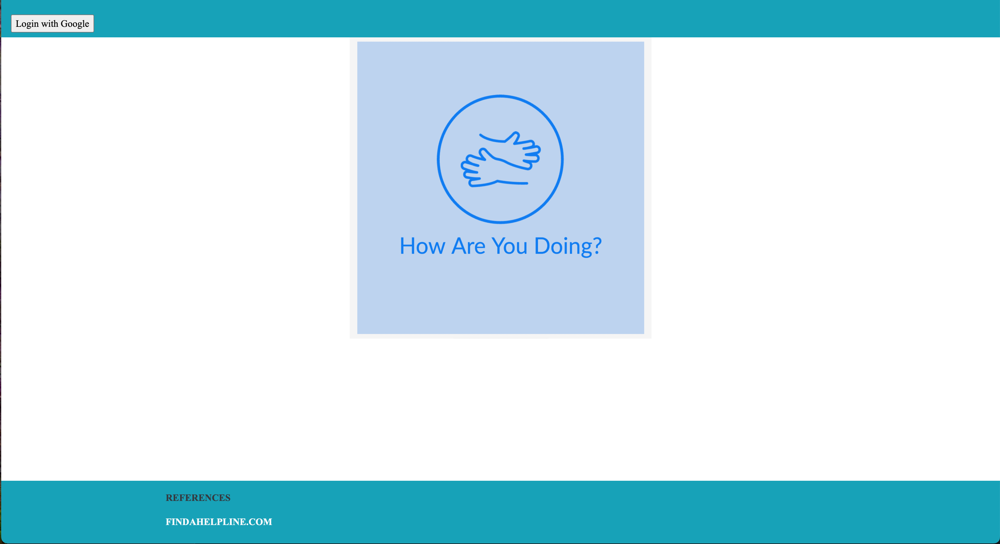
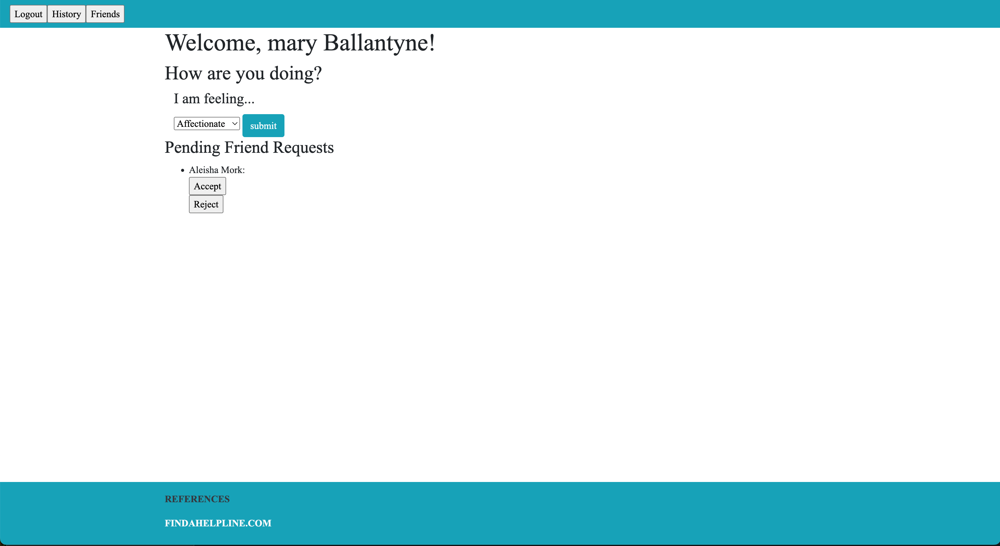

 
 

# [🔵🟢🟡 Take me to the site! 🟡🟢🔵](https://how-are-you-doing-fe.herokuapp.com/)

# "How Are You Doing?" is a group project where a user can create an account, reflect and log their feelings, and check in on friends.
 
 

## Purpose of the Front End for How Are You Doing
Having SOA allows us to use Single Responsibility Principle and keep our application streamlined. It means that if the needs of our app change, we can be more flexible than if we had a monolith. It allows us to create multiple front-ends in the future, such as the possibility of a mobile application to go with this web application. The responsibility of this Front End is to store the user data, make requests to the back end, and then render a view for the user.
## Local Setup for any other use
 - Fork and Clone the repo
 - Install gem packages: `bundle install`
 - Setup the database: `rails db:create`

## Versions
 Ruby 2.7.2
Rails 5.2.6

# How Are You Doing? FE Walkthrough
## Login
A user will login via GoogleOauth

## First Page: Emotion Post
- Upon Login, a user will be presented with a dropdown list of emotions to begin the process of creating a post. 
- This page will also display any new pending friend requests

## Emotion Post Form
- A user will be prompted to jot down their thoughts in a text field, on why they selected the emotion on the previous page, and how they're feeling for the day
- They will also have the option to go back and change a previously selected emotion
- This page will also display a definition of the chosen emotion
- A user will be able to select whether they want to keep their post private or shared

## Completed Post
- Upon submitting a completed emotions post, the user will be taken to a new page where a tone analyzer will interpret the tone of the text field filled out on the previous page
- It will also display the date this post was created, as well as whether or not it was shared or kept private
- Should a user wish to make changes, they have the option of either deleting or editing this post

## Post History
- At the top of a users dashboard page, is a button to direct a user to their post history
- this page will display a list of previously created posts, private or shared, so they may keep track of their emotions.
- In addition, should a new post be created and added to the user post history page, a success message will display when one was successfully created

## Search for a Friend
- The friends button at the top of the dashboard page will take a user to the friends index page.
- A user can also search for their friends via email in the form at the top of the page.
- After filling in the search field with the email of an existing user, their name will appear below the search field along with a button to send a friend request!

## Send Friend Request
- After clicking the Send Friend Request button, a success message will display if the request went through successfully
- A user will also see the email they sent the friend request to underneath the Sent Friend Request column

## Friends Index: Check on your Friends!!
- And hey check it out! The friend we previously searched for and sent a friend request to accepted our request and is now displayed under our Friend List!
- Each friend a user follows will be displayed with their name as a link which will direct the user to their show page.

## Check on Friends: 
- After clicking on the link of a friend under a users friend list, it will take them to the friends show page
- A user will then be able to see any posts that friend decided to make public
- At the top of any page(as long as the user is not already on that page) will be a navbar to take a user back to their dashboard or history page. 
- A user will be able to logout as well at any time

## Footer: at the bottom of each page
- At the bottom of each page is a link which will take a user to a helpline resource in the event they feel as though they need some outside help.

## Thanks for checking out our app! Remember to check up on one another, and perhaps even more importantly yourself.

## OAuth
This application utilizes Google OAuth for login and user profile creation. Utilizing OAuth allows us to have user verification and a more fluid signup process. With the data from Google, we can use information such as email so that friends can only follow users they know. This email requirement offers an added layer of privacy while still allowing for friendship interactions. 

## [How Are You Doing - Back End](https://github.com/How-Are-You-Doing/How_Are_You_Doing_BE)
- To see how our Applications Back End Service is built, reveiw all endpoint documentation, see the exteral API's is intigarted into our applications design checkout our [How Are You Doing Back End Repo](https://github.com/How-Are-You-Doing/How_Are_You_Doing_BE)

## Contributors

 **Andrew Mullins** -  - [GitHub Profile](https://github.com/mullinsand) - [LinkedIn](https://www.linkedin.com/in/andrewmullins233)

**Mary Ballantyne** -  - [GitHub Profile](https://github.com/mballantyne3) - [LinkedIn](https://www.linkedin.com/in/mary-ballantyne-2712241b2)

**Aleisha Mork** -  - [GitHub Profile](https://github.com/aleish-m) - [LinkedIn](https://www.linkedin.com/in/aleisha-mork/)

**Carter Ball** -  - [GitHub Profile](https://github.com/cballrun) - [LinkedIn](https://www.linkedin.com/in/carter-ball-01b669160/)

**Alaina Kneiling** -  - [GitHub Profile](https://github.com/alaina-noel) - [LinkedIn](https://www.linkedin.com/in/alaina-noel/)

