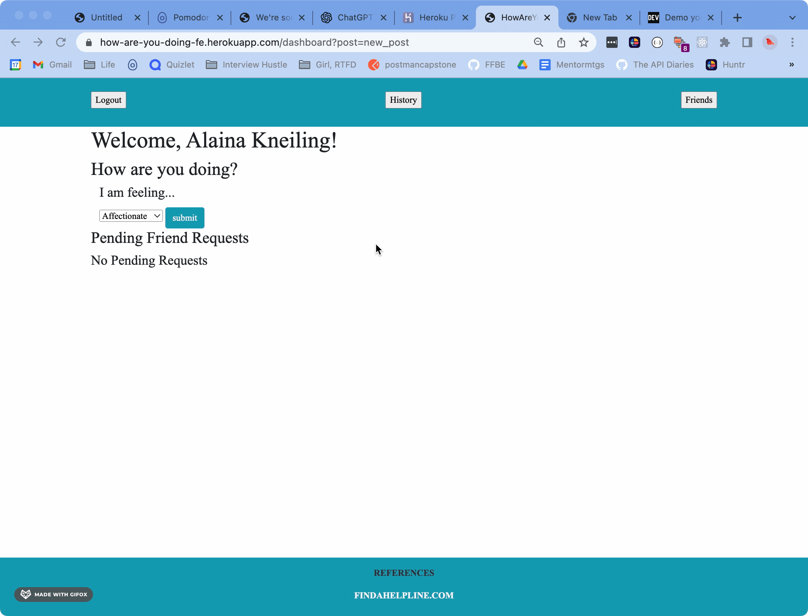
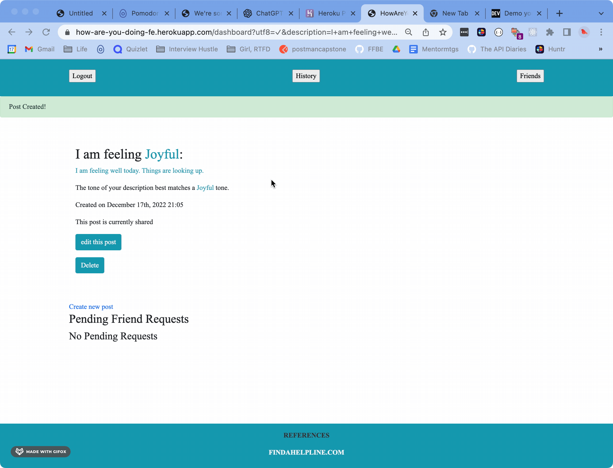
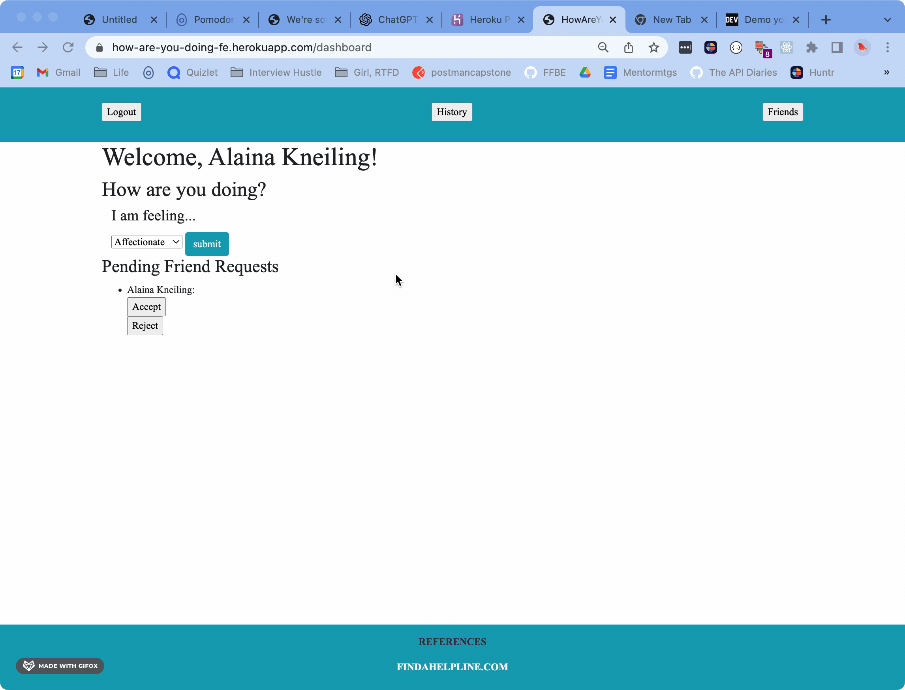

# How Are You Doing?   A place where users can reflect on their    feelings and check in on friends. 
 

## Users can select from a menu of emotions and log how they are feeling today  

## Users can look at their previous posts and edit if desired  

## Users can find friends and see how they are doing by checking their public posts  

(<a href="#readme-top">back to top</a>)

   
 # [🔵🟢🟡 Take me to the site! 🟡🟢🔵](https://how-are-you-doing-fe.herokuapp.com/)

## Technologies

## Local Setup for any other use
  Fork and Clone the repo  
  Install gem packages: `bundle install`  
  Setup the database: `rails db:{create, migrate}`  

## Versions
[Ruby 2.7.2](https://www.ruby-lang.org/en/documentation/installation/)  
[Rails 5.2.6](https://guides.rubyonrails.org/v5.0/getting_started.html#installing-rails)

## OAuth
This application utilizes Google OAuth for login and user profile creation. Utilizing OAuth allows us to have user  verification and a more fluid signup process. With the data from Google, we can use information such as email so  that friends can only follow users they know. This email requirement offers an added layer of privacy while still  allowing for friendship interactions. 

## [How Are You Doing - Back End](https://github.com/How-Are-You-Doing/How_Are_You_Doing_BE)
- To see how our Applications Back End Service is built, reveiw all endpoint documentation, see the exteral API's  is intigarted into our applications design checkout our [How Are You Doing Back End Repo](https://github.com/How-Are-You-Doing/How_Are_You_Doing_BE)

### Purpose of the Front End for How Are You Doing
Having SOA allows us to use Single Responsibility Principle and keep our application streamlined.  It means that if the needs of our app change, we can be more flexible than if we had a monolith.   It allows us to create multiple front-ends in the future, such as the possibility of a mobile application to go with this web application.   The responsibility of this Front End is to store the user data, make requests to the back end,  and then render a view for the user.

## Contributors

 **Andrew Mullins** - [GitHub Profile](https://github.com/mullinsand) - [LinkedIn](https://www.linkedin.com/in/andrewmullins233)

**Mary Ballantyne** - [GitHub Profile](https://github.com/mballantyne3) - [LinkedIn](https://www.linkedin.com/in/mary-ballantyne-2712241b2)

**Aleisha Mork** - [GitHub Profile](https://github.com/aleish-m) - [LinkedIn](https://www.linkedin.com/in/aleisha-mork/)

**Carter Ball** - [GitHub Profile](https://github.com/cballrun) - [LinkedIn](https://www.linkedin.com/in/carter-ball-01b669160/)

**Alaina Kneiling** - [GitHub Profile](https://github.com/alaina-noel) - [LinkedIn](https://www.linkedin.com/in/alaina-noel/)

